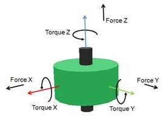
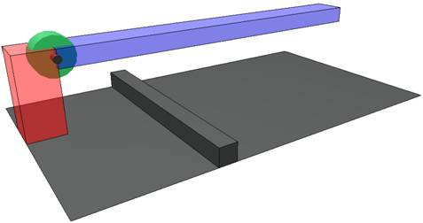
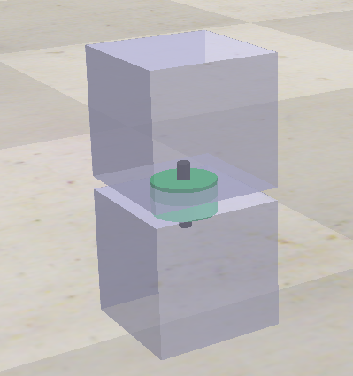
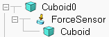
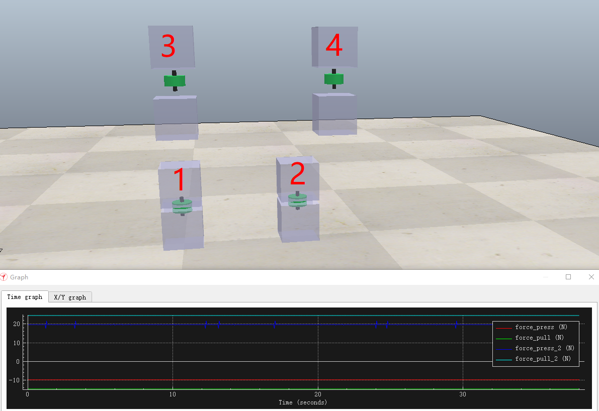

CoppeliaSim中力传感器的方向问题

最近在CoppeliaSim中使用到了力传感器，之前也简单使用了一次，但是这次使用的时候发现力传感器读取得到的力的值有一些方向上的问题（正负值的问题），官方的说法比较模糊，因此决定自己总结一下，在此分享出来。

# CoppeliaSim中的力/力矩传感器

在CoppeliaSim中提供了如下图所示的力矩传感器：

它可以测量沿着$x, y, z$三个坐标轴方向上的力以及绕这三个轴的扭矩。

# 使用方法

在实际使用的过程中，该力传感器需要在两端连接两个object才能使用，无论是力还是力矩都是这样，因为它本质上相当于是在检测几何物体的受力变形情况来计算力和扭矩。

检测扭矩：

检测拉压力：

# 力的方向

因为是连接两个object，当两个object发生相对运动时，力的方向需要明确。

传感器本身是带有一个自己的参考系的，如第一个图所示，因此在使用时力传感器有一个绝对姿态，这里我们以Z方向的力检测为例来说明使用传感器的方向问题。

在使用力传感器连接两个object的时候，我们会有类似如下的连接结构：

在这里，力传感器被连接到其父object（Cuboid0）上，而另一个object连接到力传感器下方，作为其子object。此时，力传感器相当于是绑定在父object上的，因此，**力的正负由子obejct的运动方向与传感器的正方向共同决定**。

例如在下面这个图中，我们通过在传感器的两端连接2个cube来测试“压缩力”和“拉伸力”的检测情况。

我们有四种情况，1和3是放在地上的，此时传感器处于“压缩”状态，2和4是挂在空中的，此时传感器处于“拉伸”状态，其中：

1. 传感器的z方向朝上，传感器的父object是放在地面上的那个cube，对应图中的force_press；
2. 传感器的z方向朝上，传感器的父object是处于上方的那个cube，对应图中的force_pull；
3. 传感器的z方向朝下，传感器的父object是放在地面上的那个cube，对应图中的force_press_2；
4. 传感器的z方向朝下，传感器的父object是处于上方的那个cube，对应图中的force_pull_2。

在这四种情况中，所检测到的“压力”或“拉力”如图中的曲线所示，我们可以看到，force_press和force_pull中力的值为负，force_press_2和force_pull_2中力的值为正。

四种情况的对应解释如下：

1. 父object是放在地面上的cube，传感器方向朝**上**，那么力的方向由第二个object，也就是上方的cube决定。此时上方的cube受到重力会往下压，因此传感器受到一个与其正方向相反的力，其读取到的力值为负；
2. 父object是放在地面上的cube，传感器方向朝**下**，那么力的方向由第二个object，也就是上方的cube决定。此时上方的cube受到重力会往下压，因此传感器受到一个与其正方向相同的力，其读取到的力值为正；
3. 父object是处于上方的cube，传感器方向朝**上**，那么力的方向由第二个object，也就是下方的cube决定。此时下方的cube由于受到重力会往下拉，因此传感器受到一个与其正方向相反的力，其读取到的力值为负；
4. 父object是处于上方的cube，传感器方向朝**下**，那么力的方向由第二个object，也就是下方的cube决定。此时下方的cube由于受到重力会往下拉，因此传感器受到一个与其正方向相同的力，其读取到的力值为正。

# 结论

因此，在使用过程中，要判断传感器检测到的力值的符号，我们需要首先判断传感器是相对于谁是“静止的”，在VREP中是相对于其父object静止。因此，第二个obejct（子object）与传感器的父object的相对运动方向决定了它们之间是“压缩”的还是“拉伸”的，同时再参考传感器的安装方向，通过对比两个object的运动方向与传感器的安装方向来确定其检测到力值的符号。

